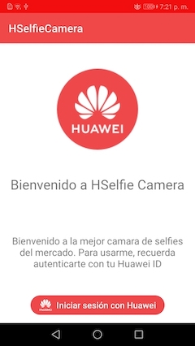
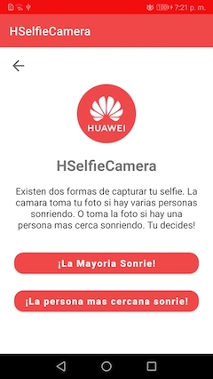
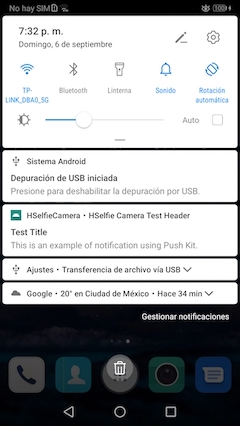

# HSelfie Camera Project

This is a project for the course **[Curso de Desarrollo de Aplicaciones con Huawei](https://platzi.com/clases/aplicaciones-huawei/)** from **Platzi**.

## Screenshots

## User Experience

In this project I've worked the following features:

* Implementation of authentication service.
* Implementation of notification service.
* Detection of face and emotions of the user using AI.

## Implementation Guidance

* HMS Account Kit.
* HMS ML Kit.
* HMS Push Kit.

## Improvement

This project will implement the next tasks:

* Improving LiveFaceCameraViewModel.
* Implementing DI.
* Implementing Unit Tests.